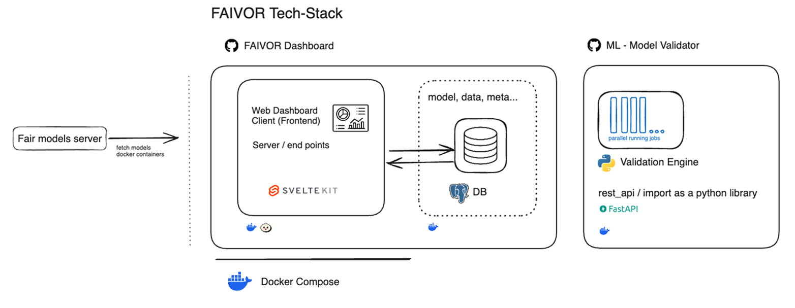
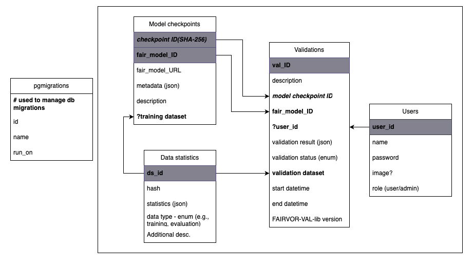

# Summary

Artificial intelligence (AI) models are increasingly developed for clinical decision support, yet a significant translational gap exists between research publications and clinical implementation. AI models described in scientific papers often lack machine-interpretable specifications, hampering independent validation and limiting uptake in clinical practice. The European Medical Device Regulation (MDR) requires substantial evidence of AI performance through independent validations before certification, creating an urgent need for standardized validation infrastructure.

FAIVOR (FAIR AI Validation and Quality Control) addresses this challenge by providing an open-source software platform that enables systematic, reproducible validation of AI models throughout their lifecycle. Built upon FAIR principles (Findable, Accessible, Interoperable, Reusable) and integrating with the FAIRmodels metadata standard [@fairmodels], FAIVOR supports three critical validation phases: (1) gathering evidence for MDR certification requirements, (2) assessing model performance before clinical implementation, and (3) continuous quality monitoring of deployed AI systems to detect data and model drift.

# Statement of Need

The deployment of AI models in clinical practice faces several interconnected challenges that FAIVOR directly addresses:

## The Reproducibility Crisis in Clinical AI

AI models published in scientific literature are typically described in human-readable text, with incomplete technical specifications that prevent proper replication and validation [@hutson2018artificial]. Existing reporting standards such as TRIPOD [@collins2015tripod] and model cards [@mitchell2019model] describe *what* information to report but lack syntactic methodologies for machine-interpretable descriptions. This hampers the ability to execute and independently validate published models.

## Regulatory Requirements Under MDR

The European Medical Device Regulation treats AI models as medical devices, demanding strict criteria including CE-certification based on substantial independent validation evidence [@muehlematter2021approval]. Without standardized validation software, hospitals and notified bodies cannot efficiently gather the evidence required to demonstrate model robustness across diverse populations and clinical settings.

## The Pre-Implementation Assessment Gap

Even CE-certified AI models may not perform as advertised in specific hospital environments due to differences in patient populations, clinical workflows, imaging equipment, and data acquisition protocols. Hospitals must validate models in their local context before deployment, but lack accessible tools to perform such assessments systematically [@vansoest2017prospective].

## Continuous Quality Assurance

Once deployed, AI models require ongoing monitoring as clinical workflows evolve, equipment changes, and patient populations shift---phenomena collectively known as data drift [@vela2022temporal]. Without continuous validation infrastructure, performance degradation may go undetected, potentially compromising patient safety.

**Research Question**: Can we overcome the translational gap for AI models by providing a software platform for regular validations and publishing validation results using machine-readable FAIR descriptions?

# Architecture and Implementation

FAIVOR consists of two main components working in concert to provide end-to-end validation capabilities (Figure 1).

{#fig:architecture}

## Validation Backend (FAIVOR-ML-Validator)

The Python-based backend, built with FastAPI, provides a REST API for executing containerized AI models and computing standardized validation metrics. Key capabilities include:

- **FAIR Model Integration**: Parses FAIRmodels JSON-LD metadata to extract model specifications, input/output definitions, and Docker image references for automated execution.
- **Containerized Model Execution**: Models packaged as Docker containers following a standardized interface (`/predict`, `/status`, `/result` endpoints) ensure reproducibility and isolation across validation environments.
- **Comprehensive Metrics Calculation**: Supports both classification and regression models with over 25 performance metrics (accuracy, AUC-ROC, F1, MAE, RMSE), 3 fairness metrics (disparate impact, statistical parity difference, equal opportunity difference), and explainability measures.
- **Threshold Analysis**: For classification models, computes metrics across 101 probability thresholds, generating ROC and precision-recall curves for comprehensive performance characterization.
- **Subgroup Analysis**: Automatic computation of metrics stratified by categorical features, enabling identification of performance disparities across demographic groups---essential for fairness auditing.

The metrics system uses YAML configuration files for metric registration, enabling users to add custom metrics without modifying core code:

```yaml
fairness:
  - function_name: disparate_impact
    regular_name: Disparate Impact
    func: faivor.metrics.classification.fairness.disparate_impact
```

## Web Dashboard

The dashboard, built with SvelteKit 2 and Svelte 5, provides an intuitive interface designed for clinical researchers and data scientists who need to validate AI models without deep technical expertise.

### Guided Validation Workflow

FAIVOR guides users through the validation process with a step-by-step workflow:

1. **Model Import**: Users import models by simply providing a FAIRmodels URL---the system automatically extracts metadata, input/output specifications, and container references
2. **Dataset Configuration**: An interactive column mapping interface helps users align their CSV test data with model expectations, with validation feedback to prevent errors
3. **Validation Execution**: Real-time progress indicators show validation status as the containerized model processes test data
4. **Results Review**: Comprehensive metrics are presented immediately upon completion

### Interactive Data Visualization

The dashboard provides rich visualizations for understanding model performance:

- **ROC and Precision-Recall Curves**: Interactive Chart.js plots for classification threshold analysis
- **Performance Metrics Overview**: Spider charts showing multiple metrics at a glance
- **Subgroup Performance**: Bar charts comparing metrics across demographic groups for fairness assessment
- **Metric Comparisons**: Side-by-side visualization of multiple validation runs to track performance over time

{#fig:dashboard}

### Accessibility and Reporting

- **No-Code Interface**: Clinical staff can execute validations without programming knowledge
- **PDF Report Generation**: One-click export of validation results as formatted reports suitable for regulatory submissions, audit trails, and clinical documentation
- **Search and Organization**: Filter and search models by title, description, or validation status
- **Role-Based Access Control**: Multi-user support with authentication via Auth.js and PostgreSQL session storage, enabling team-based validation workflows in clinical environments

## Technical Architecture

| Component | Technology |
|-----------|------------|
| Backend API | FastAPI with Pydantic validation |
| Frontend | Svelte 5 / SvelteKit 2 |
| Build Runtime | Bun |
| Styling | Tailwind CSS 4.0 / DaisyUI 5.0 |
| Database | PostgreSQL |
| Containerization | Docker / Docker Compose |
| CI/CD | GitHub Actions with semantic versioning |

The database schema (Figure 3) captures model checkpoints with their FAIRmodels metadata, validation runs with results, dataset statistics, and user management for multi-tenant deployments.

{#fig:database}

# Potential Use Cases

FAIVOR is designed to support AI validation across diverse healthcare scenarios:

## Clinical Decision Support Models

AI models predicting treatment outcomes or guiding clinical decisions require rigorous validation before deployment. FAIVOR enables:

- Pre-implementation validation to assess model performance on local patient populations
- Regular performance monitoring for deployed decision support models
- Evidence collection for regulatory compliance documentation (e.g., EU MDR)

## Medical Image Analysis

Deep learning models for automatic segmentation, classification, or detection on medical images benefit from systematic validation workflows. FAIVOR supports standard image analysis metrics and tracks performance as imaging equipment and acquisition protocols evolve.

## Research Model Benchmarking

Researchers developing new AI models can use FAIVOR to benchmark against existing approaches, ensuring reproducible comparisons using standardized metrics and documented validation procedures.

# FAIR Principles Alignment

FAIVOR embodies FAIR principles both in its own development and in enabling FAIR validation workflows:

- **Findable**: Registered in the Research Software Directory, comprehensive CITATION.cff with ORCID identifiers, OpenAPI documentation for API discovery, detailed installation documentation, software versions with distinct identifiers
- **Accessible**: Docker Compose deployment, software is retrivable using standardized protocol which is open and free
- **Interoperable**: FAIRmodels JSON-LD metadata integration, YAML-based extensible metrics configuration, REST API for programmatic access
- **Reusable**: Apache 2.0 license, contribution guidelines, code of conduct, semantic versioning, comprehensive test suite, ML-Validator can be executed independently

The platform builds upon FAIR4AI concepts, creating a web of linked data describing AI models and their independent validation results. This enables researchers to discover validation evidence. In the future, notified bodies might assess certification applications, and hospitals find models validated in similar clinical contexts.

# Quality Assurance

FAIVOR maintains rigorous software quality standards aligned with Netherlands eScience Center guidelines:

- **Testing**: Comprehensive test suites including unit tests (stores, utilities, data transformations), integration tests (API endpoints), and backend tests (metrics calculations, Docker integration)
- **Type Safety**: TypeScript strict mode for frontend, Python type hints with Pydantic validation for backend
- **Automated CI/CD**: GitHub Actions workflows for testing, semantic version bumping based on conventional commits, and container image building
- **Documentation**: Deployment guides, API documentation, contribution guidelines, and inline code documentation

# Related Work

While several tools address aspects of ML model validation, FAIVOR uniquely combines FAIR principles with clinical validation requirements:

- **MLflow** and **Weights & Biases** focus on experiment tracking rather than independent external validation
- **Fairlearn** and **AI Fairness 360** provide fairness metrics but lack integrated model execution and clinical deployment context
- **Model Card Toolkit** addresses documentation but not automated validation execution

FAIVOR's integration with FAIRmodels metadata and focus on clinical AI lifecycle management fills a critical gap in the research-to-practice pipeline.

# Acknowledgements

This work was supported by the Netherlands eScience Center under project NLESC.OEC.2023.072. We thank our clinical partners for requirements and validation support, and the broader FAIR4AI and Health-RI communities for valuable feedback.

# References
