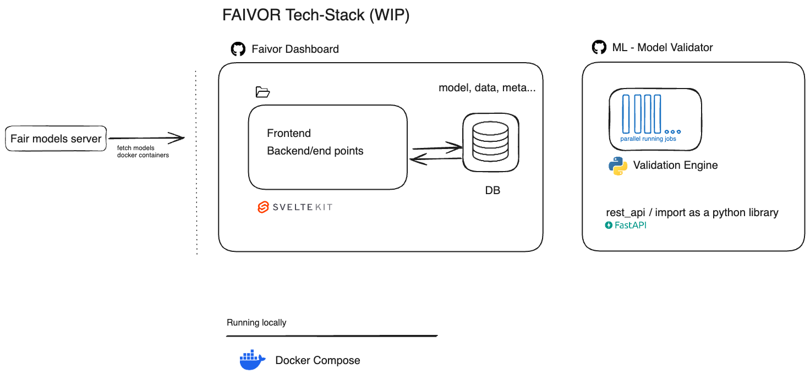
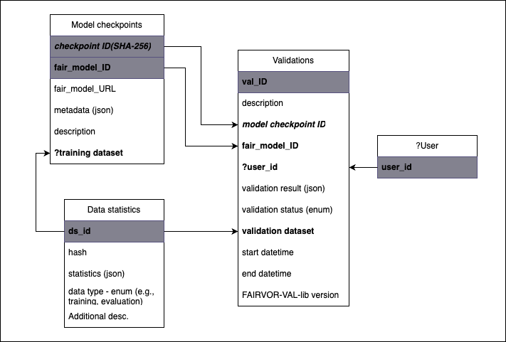

# FAIRmodels-validator Dashboard

FAIRmodels-validator Dashboard is a web application that allows users to validate their FAIRmodels.

Architecture


Database schema


# Running on Development

This project includes Docker configuration for easy deployment and development. Follow these steps to run the application using Docker:

### Prerequisites
- Docker Compose installed on your system

### Environment Setup

1. Create a `.env` file in the root directory:
```bash
cp dashboard/_example .env dashboard/.env
```

2. Update the `.env` file with your desired configuration:
- Generate an AUTH_SECRET using: `npx auth secret`
- Modify database credentials if needed (default values are secure for local development)


1. Start the development environment:
```bash
docker compose up
```
The application will be available at `http://localhost:5173`

1. (Optional) Seed the database with sample data:
```bash
docker compose run seed
```

### Production Deployment

```bash
docker compose -f docker-compose.prod.yml up
The application will be available at `http://localhost:3000`
```

### Managing the Application
Stop the application:
```bash
# Development
docker compose down

# Production
docker compose -f docker-compose.prod.yml down
```

View logs:
```bash
# All services
docker compose logs

# Specific service
docker compose logs postgres
docker compose logs frontend
```

Remove volumes (deletes database data):
```bash
docker compose down -v
```

### Production Considerations

The application requires HTTPS in production for authentication to work properly.
