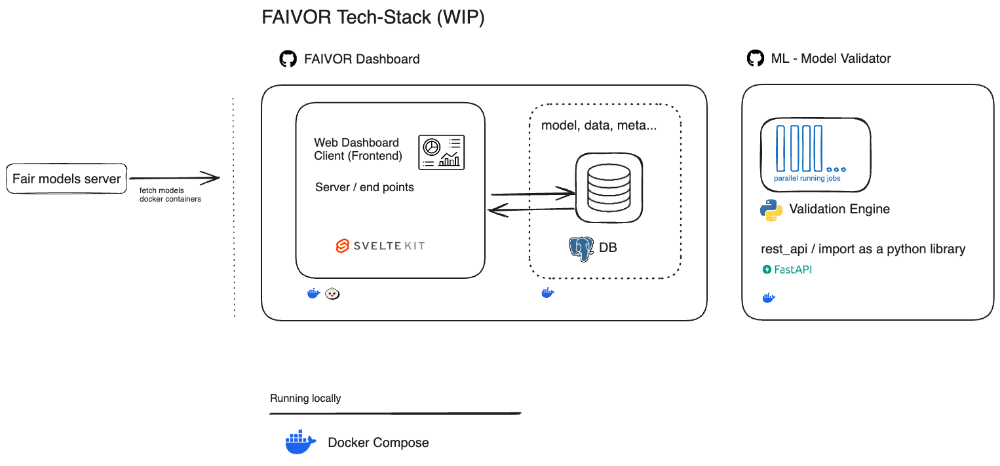
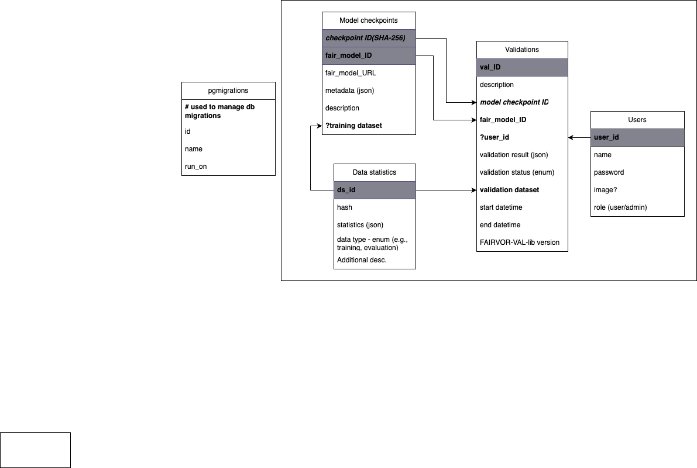

# FAIVOR Dashboard

[](https://opensource.org/licenses/Apache-2.0)
[](https://research-software-directory.org/projects/faivor)

## FAIRmodels-validator Dashboard

FAIRmodels-validator Dashboard is a web application that allows users to validate their FAIRmodels.

Architecture


Database schema


## Running with Docker

### Development (default)

```bash
git clone https://github.com/MaastrichtU-BISS/FAIVOR-Dashboard.git
docker compose up
```

Visit [http://localhost:5173](http://localhost:5173). Changes to the code in `dashboard/` will automatically hot reload.

This setup:
- Mounts your local `dashboard/` code into the container
- Runs `bun dev` with hot module replacement
- Runs database migrations automatically
- Uses pre-built backend image
- No need to install anything locally

### Backend Development (optional)

To also develop the ML-Validator backend with hot reload, first clone the backend repo:

```bash
git clone https://github.com/MaastrichtU-BISS/FAIVOR-ML-Validator.git
docker compose --profile backend-dev up --scale faivor-backend=0
```

This mounts `FAIVOR-ML-Validator/src/` and enables Python hot reload.

### Troubleshooting

If you encounter errors (missing files, migrations failing, 404 errors), rebuild the images without cache:

```bash
docker compose down
docker compose build --no-cache
docker compose up
```

### Production

For production deployment, use the pre-built images from GitHub Container Registry:

1. Create a `.env` file at the repo root with your configuration:

```bash
cat > .env << 'EOF'
DB_USER=postgres
DB_PASSWORD=your-secure-password
DB_NAME=faivor
DB_PORT=5432
AUTH_SECRET=generate-with-openssl-rand-base64-32
AUTH_URL=http://localhost:3000
PUBLIC_VALIDATOR_URL=http://faivor-backend:8000
PUBLIC_ORGANIZATION_NAME=FAIVOR
EOF
```

> **Note:** For production with HTTPS, set `AUTH_URL=https://your-domain.com`

2. Run the production stack:

```bash
docker compose -f docker-compose.prod.yml up
```

Visit [http://localhost:3000](http://localhost:3000). This uses pre-built images from the GitHub Container Registry (built by CI/CD).

### Production Considerations

- The application requires HTTPS in production for authentication to work properly.
- For **development**, no `.env` file is needed - sensible defaults are used automatically.
- For **production**, configure the following environment variables:

#### Required Environment Variables

| Variable | Description | Example |
|----------|-------------|---------|
| `DB_HOST` | PostgreSQL database host | `postgres` |
| `DB_PORT` | PostgreSQL database port | `5432` |
| `DB_USER` | Database username | `faivor` |
| `DB_PASSWORD` | Database password | `your-secure-password` |
| `DB_NAME` | Database name | `faivor` |
| `AUTH_SECRET` | Secret for signing auth tokens (generate with `openssl rand -base64 32`) | `abc123...` |
| `AUTH_URL` | Base URL for authentication (use `http://` for local, `https://` for production) | `https://your-domain.com` |

#### Optional Environment Variables

| Variable | Description | Default |
|----------|-------------|---------|
| `PUBLIC_VALIDATOR_URL` | URL of the FAIVOR ML Validator backend | `http://localhost:8000` |
| `PUBLIC_DASHBOARD_ORIGIN` | Allowed CORS origins (comma-separated for multiple) | _(none - same-origin only)_ |
| `PUBLIC_ORGANIZATION_NAME` | Organization name shown in the UI | `FAIVOR` |

#### Docker Compose Example

```yaml
services:
  dashboard:
    image: ghcr.io/maastrichtu-biss/faivor-dashboard:main
    environment:
      - DB_HOST=postgres
      - DB_PORT=5432
      - DB_USER=faivor
      - DB_PASSWORD=${DB_PASSWORD}
      - DB_NAME=faivor
      - AUTH_SECRET=${AUTH_SECRET}
      - AUTH_URL=https://your-domain.com
      - PUBLIC_VALIDATOR_URL=http://faivor-backend:8000
      - PUBLIC_DASHBOARD_ORIGIN=https://your-domain.com
      - PUBLIC_ORGANIZATION_NAME=Your Organization
```

### Reverse Proxy Configuration

When deploying behind a reverse proxy (e.g., Nginx, Traefik, Caddy), the following security measures should be configured at the proxy level:

1. **Origin Header Validation**: The application has `checkOrigin: false` to support reverse proxy setups. Your proxy should validate the `Origin` header to prevent CSRF attacks.

2. **Required Headers**: Ensure your proxy forwards these headers:
   - `X-Forwarded-For`
   - `X-Forwarded-Proto`
   - `X-Forwarded-Host`
   - `Origin`

3. **Environment Variables**: Set `PUBLIC_DASHBOARD_ORIGIN` to your public URL(s) for CORS:
   ```
   PUBLIC_DASHBOARD_ORIGIN=https://your-domain.com
   ```

4. **Example Nginx configuration**:
   ```nginx
   location / {
       proxy_pass http://dashboard:3000;
       proxy_set_header Host $host;
       proxy_set_header X-Real-IP $remote_addr;
       proxy_set_header X-Forwarded-For $proxy_add_x_forwarded_for;
       proxy_set_header X-Forwarded-Proto $scheme;
       proxy_set_header X-Forwarded-Host $host;
   }
   ```

## CI/CD & Docker Images

Docker images are automatically built and pushed to GitHub Container Registry on every push.

### Dashboard
- **Workflow**: `.github/workflows/dashboard-docker-build.yml`
- **Trigger**: Push to any branch
- **Image**: `ghcr.io/maastrichtu-biss/faivor-dashboard:{branch}`
- **Dockerfile**: `dashboard/Dockerfile`

### ML-Validator Backend
- **Workflow**: `FAIVOR-ML-Validator/.github/workflows/publish-docker.yml`
- **Trigger**: Push/PR to main
- **Image**: `ghcr.io/maastrichtu-biss/faivor-ml-validator:latest`
- **Dockerfile**: `FAIVOR-ML-Validator/Dockerfile`

### Flow
```
Push to main → GitHub Actions → Build image → Push to ghcr.io → Production pulls image
```

## Features

- Validate FAIRmodels via a user-friendly dashboard
- Import models by URL
- Delete models from the list with immediate UI update (no page reload required)
- View model details and validation results
- Search for models by title or description
- Export model metadata to FAIR models repository
